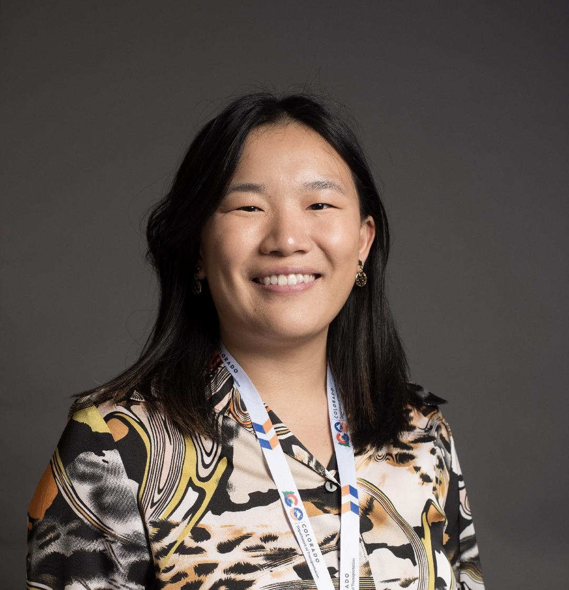

---
#
# By default, content added below the "---" mark will appear in the home page
# between the top bar and the list of recent posts.
# To change the home page layout, edit the _layouts/home.html file.
# See: https://jekyllrb.com/docs/themes/#overriding-theme-defaults
#
layout: home
---

_Welcome!_

I am a first-year political science Ph.D. student at in the [Truman School of Government and Public Affairs](https://truman.missouri.edu/) at the University of Missouri. My subfields are comparative politics and international relations. I received my B.A. in Global Studies with a emphasis in world cultures from [Boise State University](https://www.boisestate.edu/sps-global/) in 2022.

Broadly, I have research interests in intrastate conflict processes, rebel groups, and political parties. More specifically, I am interested in party development and competition in post-civil war contexts.

Please browse my website for additional information about my experience and work. Feel free to contact me via <a href = "mailto: rywqzv@umsystem.edu">email</a> with questions.
